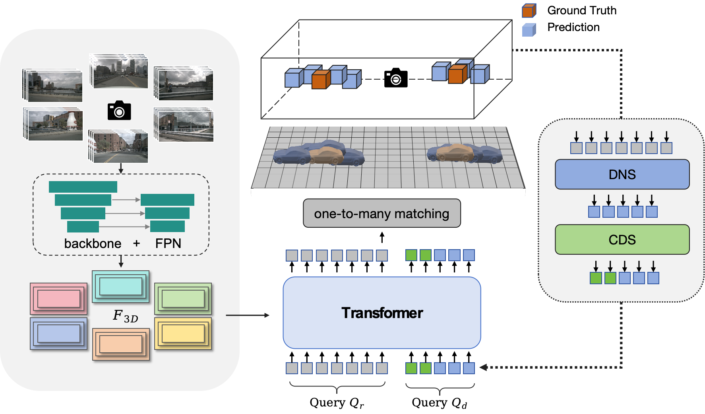

<div align="center">
<h1>SelfDN: Adaptive Self-Denoising for Multi-View 3D Object Detection</h1>
</div>

## Introduction

This repository is an official implementation of our paper Ray Denoising: Depth-aware Hard Negative Sampling for Multi-view 3D Object Detection. This repository contains Pytorch training code, evaluation code and pre-trained models.

## Framework
<div align="center">
  
</div><br/>

## Getting Started

Our code is built based on [StreamPETR](https://github.com/exiawsh/StreamPETR). Please follow [StreamPETR](https://github.com/exiawsh/StreamPETR) to [setup enviroment](https://github.com/exiawsh/StreamPETR/blob/main/docs/setup.md) and [prepare data](https://github.com/exiawsh/StreamPETR/blob/main/docs/data_preparation.md) step by step.

## Training and Inference
You can train the model following:

```angular2html
tools/dist_train.sh projects/configs/SelfDN/selfdn_r50_704_bs2_seq_428q_nui_60e.py 8
```

You can evaluate the detection model following:
```angular2html
tools/dist_test.sh projects/configs/SelfDN/selfdn_r50_704_bs2_seq_428q_nui_60e.py work_dirs/selfdn_r50_704_bs2_seq_428q_nui_60e/latest.pth 8 --eval bbox
```


## Results on NuScenes Val Set.
| Model | Setting |Pretrain| Lr Schd | NDS| mAP| Config | Download |
| :---: | :---: | :---: | :---: | :---:|:---:| :---: | :---: |
| SelfDN | R50 - 428q | NuImg | 24ep | 53.8 | 44.3 | [config](projects/configs/SelfDN/selfdn_r50_704_bs2_seq_428q_nui_24e.py) | [ckpt](https://pan.baidu.com/s/1dcR3txbqbvZicmKzUFxcRw?pwd=sxkb) |
| SelfDN | R50 - 428q | NuImg | 60ep | 56.8 | 47.9 | [config](projects/configs/SelfDN/selfdn_r50_704_bs2_seq_428q_nui_60e.py) | [ckpt](https://pan.baidu.com/s/1Jg7Ya0HtAxa9BipWtkyqBQ?pwd=q2v1) |


## Acknowledgements

We thank these great works and open-source codebases:
[MMDetection3d](https://github.com/open-mmlab/mmdetection3d), [StreamPETR](https://github.com/exiawsh/StreamPETR), [DETR3D](https://github.com/WangYueFt/detr3d), [PETR](https://github.com/megvii-research/PETR), [RayDN](https://github.com/LiewFeng/RayDN).


